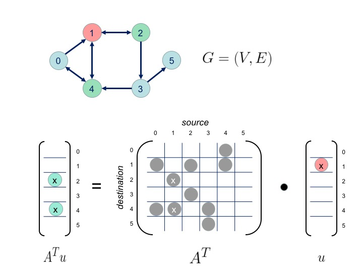

<!--

License ...

-->

* This will become a table of contents (this text will be scraped).
{:toc}

# Overview

Graph-based algorithms play a crucial role in workflows for analyzing
large datasets in domains such as social networks, biology, fraud
detection, and sentiment analysis. The simplicity and generality of
graphs make them a popular mechanism for simultaneously addressing
issues of complexity and
scale. [Apache Spark](http://spark.apache.org/) provides a JVM-based
framework that supports the distributed processing of large data sets
across clusters of computers.  Spark uses a distributed memory
abstraction that enables in-memory computations on large clusters in a
fault-tolerant manner.  By keeping data in memory, Spark can improve
performance by an order of magnitude when compared to traditional
(e.g., Hadoop-based) approaches.  To address Graph problems, Spark
offers the [GraphX module](http://spark.apache.org/graphx/). In
contrast to LAGraphs's linear algebra-based techniques, GraphX takes
vertex-centric approach based on Pregel
[\[Malewicz2010Pregel\]](#references). The
two alternatives differ significantly in both the formulation of
algorithms and the performance characteristics of the
implementations.

On this page provide a brief introduction to the algebraic approach
for analyzing graphs for those with a (more traditional)
vertex-centric background.

# Two approaches: Vertex-centric vs Algebraic

Both the vertex-centric and the algebraic approach
have been extensively studied in the literature. However the
vertex-centric approach is more commonly used in practice. Let's start
by taking a closer look at this approach.

## Vertex-centric approach

Look up your favorite graph algorithm in a introductory text book and
most likely you'll find a description that is vertex-centric and
written in imperative pseudocode.  Its vertex-centric in the the sense
that the primary data structure is an adjacency list implemented
either with a linked list or an array.  As an example, let's look at
the
[wikipedia description for Bellman Ford algorithm](https://en.wikipedia.org/wiki/Bellman%E2%80%93Ford_algorithm)
to compute the shortest paths from a single source vertex to all of
the other vertices in a weighted, directed graph. This is the
so-called *Single Source Shortest Path* (SSSP) problem.

```
 function BellmanFord(list vertices, list edges, vertex source)
   ::distance[],predecessor[]

   // This implementation takes in a graph, represented as
   // lists of vertices and edges, and fills two arrays
   // (distance and predecessor) with shortest-path
   // (less cost/distance/metric) information

   // Step 1: initialize graph
   for each vertex v in vertices:
       distance[v] := inf             // At the beginning , all vertices have a weight of infinity
       predecessor[v] := null         // And a null predecessor
   
   distance[source] := 0              // Except for the Source, where the Weight is zero 
   
   // Step 2: relax edges repeatedly
   for i from 1 to size(vertices)-1:
       for each edge (u, v) with weight w in edges:
           if distance[u] + w < distance[v]:
               distance[v] := distance[u] + w
               predecessor[v] := u

   // Step 3: check for negative-weight cycles
   for each edge (u, v) with weight w in edges:
       if distance[u] + w < distance[v]:
           error "Graph contains a negative-weight cycle"
   return distance[], predecessor[]
```

In the imperative approach objects tend to be mutable and
implementations are free to exploit update-in-place strategies that
avoid expensive copies.  We see this exploited in the above
pseudocode, the key variables `distance` and `predecessor` are both
mutable.  and do not require copies to be made on each iteration.  The
imperative style is also intuitive, the variables `vertex` and `edge` map
naturally to our mental image of a graph. And it's not just
pseudocode, if you look at the source code for your favorite graph
package most likely you'll find an implementation written in a
imperative style. Now let's look at an alternative, the algebraic
approach.

## Algebraic approach

Linear algebra provides a set of powerful techniques to compute
solutions in a large variety of disciplines including engineering,
physics, natural sciences, computer science, and the social sciences.
Linear algebra is defined abstractly in terms of
fields. Traditionally, fields possessing constructs for addition and
multiplication along with their respective inverses (i.e., rings such
as real and complex numbers) have been used to compute solutions in
these disciplines.
It turns out that by removing the requirement for an inverse (i.e.,
semirings) linear algebra techniques can be used to perform calculations
in several domains including a broad
range of graph computations. So why consider using the algebraic
approach?  [[Kepner2011Graphs]](#references) gives three reasons:

1. *Syntactic complexity*

    As we will see, when compared to the vertex-centric approach,
    using the algebraic approach can produce expressions that are
    arguably simpler than those produced by the vertex-centric
    approach. Also, using Scala and LAGraph to translate the algebraic
    expression into a functional language-based implementation is
    straight forward and avoids much of the complexity involved in
    implementing an algorithm using a vertex-centric, imperative
    approach.

2. *Easy parallel implementation*

    A problem with the vertex-centric approach arises when the graph
    becomes so large that you must exploit distributed techniques to
    address the scale. To exploit a vertex-centric approach in a
    distributed environment one must partition the graph into
    subgraphs. The vertex-centric approach is then used for each
    subgraph and subgraph interactions are handled with additional
    logic using using message passing. Pregel is an example of this
    approach. And, indeed, the current, core Graph library in Spark,
    GraphX is based on Pregel. The approach is still intuitive but an
    additional complexity of dealing with propagated information must
    be accommodated in the algorithm. Also, each subgraph, by
    construct, is very localized and the propagation of information
    from one partition to a destination can involve multiple hops.  As
    we will see, by contrast, using a Scala / Spark / LAGraph
    platform, the parallel expression of a graph algorithm is the same
    straight-forward expression used in the sequential expression.

3. *Performance*

    For many graph algorithms, the numerically-intensive work occurs
    in (potentially distributed) low-level sparse matrix operations
    that lend can be optimized. The details of these operations are
    hidden from users of the LAGraph API. Since they are independent
    of interface, the low-level implementation can be optimized for
    specific architectures / systems to provide performance benefits
    without requiring any changes to the higher-level algorithm.

In contrast to the vertex-centric approach and its imperative
orientation, the algebraic approach lends itself to functional
programming.  To see this, let's start by taking a look at the
building blocks for the algebraic approach.

# Graphs in the language of linear algebra

In contrast to the vertex-centric approach there is the extensively
studied, but, nevertheless, less popular algebraic approach.  The
algebraic approach is based on the adjacency matrix.  A directed graph
$G = (V,E)$ with $N$ vertices can be expressed as an $N \times N$
matrix $A$, called the *adjacency* matrix, with the property $A(i,j) =
1$ if there is an edge $e_{ij}$ from vertex $v_i$ to vertex $v_j$ and
is zero otherwise.

For the algebraic approach the intuitions are a little different, the
basic intuitive operation of finding successors by performing an edge
traversal in the vertex-centric world becomes a matrix multiplication
in the algebraic world.  Here is a simple example that demonstrates
how, given a source set of vertices, we can calculate the successors
for both the vertex-centric approach an the algebraic approach.



In this example, to find the set of successors using the
vertex-centric approach, we would just directly use the adjacency
lists for each of the source vertices, red vertices: $\lbrace v_0$,
$v_1 \rbrace$, to obtain successor vertices, green vertices: $\lbrace
v_0$, $v_2$ $v_4 \rbrace$.  If we wanted to keep track of how many
times each vertex was visited we could modify the data structure
maintaining the successor vertices to contain a pair where the first
element of the pair would now represent the vertex and the second
element in the pair could be used to store the number of times the
vertex has been visited, i.e.: $\lbrace (v_0,1)$, $(v_2,1)$, $(v_4,2)
\rbrace$.  To find out how many times successors to this initial set
of successors were visited we would just repeat the algorithm using
the initial successor as the source and incrementing the counts.

For the algebraic approach, if we assign values of $1$ to the edges
represented as gray dots in the adjacency matrix and we use conventional
definitions for scalar addition and scalar multiplication then we can
find the successors to our source vertices by performing a matrix
multiplication between the transpose of the adjacency matrix and a
source vector defined using the source vertices, i.e.:

$$
\mathbf{u}(v) = \begin{cases}
1 & \textrm{if $v = 0$ or $v = 1$}\\
0 & \textrm{otherwise}
\end{cases}
$$

after the matrix multiply the resultant vector will contain have non-zero values
representing the number of times the vertex was visited as a successor.

$$
\mathbf{A^T u}(v) = \begin{cases}
1 & \textrm{if $v = 1$ or $v = 2$ or $v = 4$}\\
2 & \textrm{if $v = 4$}\\
0 & \textrm{otherwise}
\end{cases}
$$

This vector would be equivalent to the data structure we used
to keep track of the number of successor visits in the vertex-centric
approach.

To find the successors to the initial successor vector, a subsequent multiplication

$$
A^T (A^T u)
$$

would yield a vector containing the total number of
paths from a source vector to the successors of the initial successor vector.

Let's say, given a source vector, we were not interested in how many
times a given vertex was visited but we were only interested in
determining whether or not a particular vertex was visited. The
modifications to the vertex-centric approach would be simple, instead
of tracking the number of visits in the second element of the pair we
could just store a Boolean indicating whether or not the vertex has
been visited.

For the matrix approach, instead of using conventional scalar addition
and scalar multiplication we could interpret scalar addition as a
logical "or", scalar multiplication as a logical "and", $0$ as "false"
and $1$ as "true".  Using these definitions for scalar addition and
scalar multiplication the successor vector will contain Boolean values
indicating whether or not a particular vertex has been visited.

## Redefining addition and multiplication

This was a simple example, as it turns out, by using custom
definitions for addition and multiplication we can be clever as to how
we propagate information through the graph using matrix
multiplication.  Let's look closer at the role addition and
multiplication play in matrix multiplication.

Conventionally, at least in the context of
[linear algebra](https://en.wikipedia.org/wiki/Linear_algebra), matrix
multiplication is performed using
[fields](https://en.wikipedia.org/wiki/Field_(mathematics)) usually
the [real numbers](https://en.wikipedia.org/wiki/Real_number).  Fields
support addition and multiplication operations with axioms for
associativity, commutativity, and distributivity.  Also, fields have
axioms for additive inverses and multiplicative inverses that, as it
turns out, are critical for most linear algebra applications.

In addition to fields there are a large variety of alternative
algebraic structures (e.g., semigroups, monoids, groups, abelian
groups, rings, semirings). It should be apparent that the matrix
multiplication we used to perform the graph traversal has no
requirement for an inverse. As it turns out, if you remove the
requirement for inverses, the structure that is most appropriate for
using algebraic techniques to address graph problems is the
semiring. Why is it more appropriate structure? Well, by dropping the
inverse requirements, as we did in the above example, we can define
addition and multiplication in such away as to facilitate the
implementation of a particular graph algorithm.

So what precisely is a semiring?
A *semiring* is an algebraic structure
consisting of a set of elements $S$;
two binary operations:
$\oplus$ (addition) and $\otimes$ (multiplication);
and two distingished elements:
$0$ (zero) and $1$ (one) which satisfy
the following relations for any 
$r, s, t \in S$ :

1. $(S,\oplus,0)$ is a commutative monoid with identity $0$
  * associative: $a \oplus ( b \oplus c )=( a \oplus b ) \oplus c$
  * commutative: $a \oplus b = b \oplus a$
  * identity: $a \oplus 0 = 0 \oplus a = a$

2. $(S,\otimes,1)$ is a monoid with identity $1$
  * associative: $a \otimes ( b \otimes c )=( a \otimes b ) \otimes c$
  * identity: $a \otimes 1=1 \otimes a = a$

3. $\otimes$ distributes over $\oplus$
  * $a \otimes ( b \oplus c )=( a \otimes b ) \oplus ( a \otimes c )$
  * $( b \oplus c ) \otimes a =( b \otimes a ) \oplus ( c \otimes a )$
  
4. $0$ is an annihilator under $\otimes$
  * $a \otimes 0=0 \otimes a =0$

As a convenience, $a \otimes b$ is sometimes written as $ab$ and $a
\otimes a \otimes a$ is sometimes written as $a^3$.

Closure is denoted $*$ and satisfies the axiom: $$a^* = 1 \oplus a
\otimes a^* = 1 \oplus a^* \otimes a$$

In a closed semiring an *affine map* $u \mapsto au \oplus b$ implies a
fixpoint of $a^* u$ since: $a^* b = (aa^* \oplus 1)b = a(a^*b) \oplus
b$

Hence, if our semiring is closed then the affine map we use for traversal will have a fixpoint.

Note that: $$a^* = 1 \oplus a \oplus a^2 \oplus a^3 + \ldots$$

A nice introduction to the application of semirings to graph problems can be found in [[Dolan2013Fun]](#references).

If you are sold on the algebraic approach for expressing graph algorithms but have a dislike for Scala and Java-based distributed computing and prefer more conventional HPC-based approaches then you should consider the [COMBINATORIAL_BLAS](http://gauss.cs.ucsb.edu/~aydin/CombBLAS/html/) project.

# References

**[Dolan2013Fun]** Dolan, Stephen. "Fun with semirings: a functional pearl on the abuse of linear algebra." ACM SIGPLAN Notices. Vol. 48. No. 9. ACM, 2013.

**[Kepner2011Graphs]** Kepner, Jeremy. "Graphs and Matrices." Graph Algorithms in the Language of Linear Algebra 22 (2011): 3.

**[Malewicz2010Pregel]** Malewicz, Grzegorz, Matthew H. Austern, Aart JC Bik, James C. Dehnert, Ilan Horn, Naty Leiser, and Grzegorz Czajkowski. "Pregel: a system for large-scale graph processing." In Proceedings of the 2010 ACM SIGMOD International Conference on Management of data, pp. 135-146. ACM, 2010.

